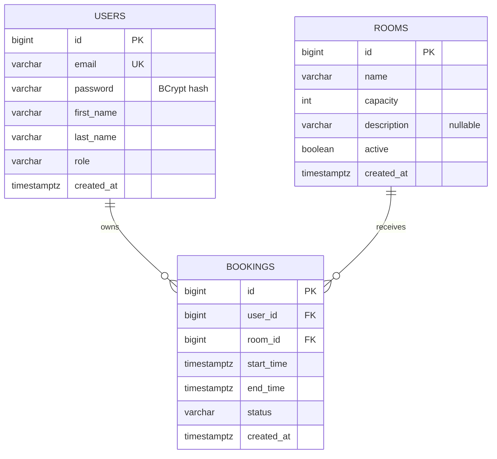

# Booking System

Учебный REST API для бронирования переговорных комнат в офисе.
Проект для портфолио Java Backend Intern / Junior, разрабатываемый поэтапно
с объяснением решений, ограничений и проверок.

> **Текущее состояние:** готовы этапы 1–2: требования, API-контракт, ER diagram,
> четыре SQL-миграции и проверка ограничений на PostgreSQL 18.6, включая две
> конкурирующие транзакции. Java-приложение, pom.xml, Docker и Swagger пока
> не добавлены. API-примеры ниже описывают целевое поведение.

Начни с [Requirements](docs/01-requirements.md), затем прочитай
[Database design](docs/02-database-design.md).
Все 15 этапов и их статус — в [плане разработки](docs/roadmap.md).

## About

Сотрудник регистрируется, входит в систему, выбирает комнату и бронирует время.
Администратор управляет комнатами и видит все бронирования.
Ключевая инженерная задача — предотвратить двойное бронирование даже при
одновременных запросах к разным экземплярам backend.

Один Spring Boot процесс, одна PostgreSQL БД, один Maven-модуль.
Логические модули — доступ и пользователи, комнаты, бронирования.
Без микросервисов и внешнего брокера сообщений.

## Features

Уже сделано:

- Функциональные/нефункциональные требования, user stories и acceptance criteria.
- Схема users / rooms / bookings, FK, CHECK, индексы и миграции V1–V4.
- PostgreSQL exclusion constraint для пересекающихся ACTIVE броней.
- Проверка SQL-схемы и реального конфликта двух транзакций.

Запланировано:

- Регистрация, BCrypt, JWT и роли USER/ADMIN.
- Каталог активных комнат и доступность заданного интервала.
- Создание и отмена своих броней; просмотр истории.
- Администрирование комнат и просмотр всех броней.
- Validation, pagination, sorting и единые ошибки.
- Unit/API/concurrency tests, Docker Compose, OpenAPI.

## Tech Stack

| Область | Технологии |
|---|---|
| Runtime / build | Java 21, Maven + Maven Wrapper |
| REST | Spring Boot, Spring Web, Bean Validation |
| Persistence | Spring Data JPA, PostgreSQL, Flyway |
| Security | Spring Security, BCrypt, JWT |
| Уменьшение шаблонного кода | Lombok; ручные mapper, MapStruct при необходимости |
| Документация | Swagger / OpenAPI |
| Тесты | JUnit 5, Mockito, Testcontainers + PostgreSQL |
| Запуск | Docker, Docker Compose |

Версии Java-библиотек и их совместимость зафиксируем на этапе 3.
SQL сейчас проверен на локальном PostgreSQL 18.6.

## Architecture

Целевая цепочка обработки запроса:

```text
HTTP -> Security filter chain -> Controller -> Service -> Repository -> PostgreSQL
                                     DTO        |            Entity
                                                +-> mapper -> Response DTO
```

Controller принимает/валидирует запрос и вызывает Service.
Service проверяет права, бизнес-правила и определяет границы транзакции.
Repository выполняет запросы. Entity никогда не возвращается из REST API.

Будущие пакеты внутри `com.example.bookingsystem`:

```text
controller/   # REST endpoints
service/      # сценарии и транзакции
repository/   # запросы Spring Data JPA
entity/       # JPA entities и enum
dto/          # request / response / pagination
mapper/       # преобразования Entity <-> DTO
security/     # JWT и текущий пользователь
exception/    # исключения и единый ответ
config/       # Security, auditing, Clock, OpenAPI
```

Текущие файлы:

```text
.gitignore
README.md
docs/
  01-requirements.md
  02-database-design.md
  roadmap.md
  schema-verification.md
src/main/resources/db/migration/
  V1__create_users.sql
  V2__create_rooms.sql
  V3__create_bookings.sql
  V4__prevent_overlapping_bookings.sql
```

## Database Schema



Интервал — `[startTime, endTime)`: встречи 10:00–11:00 и 11:00–12:00 совместимы.
V4 запрещает пересечения ACTIVE записей одной комнаты на уровне PostgreSQL;
CANCELLED записи не занимают время. Даже одновременные INSERT не обходят правило.

Планируемая транзакция Service блокирует строку Room через PESSIMISTIC_WRITE,
затем проверяет active, время и сохраняет Booking. Такой же протокол у изменения
комнаты согласует бронирование с деактивацией. Цена простоты — последовательные
операции создания в одной комнате. Сравнение альтернатив, индексы и ссылки на
документацию PostgreSQL — в [Database design](docs/02-database-design.md).

## API

**Целевой контракт; endpoints пока не реализованы.** ADMIN наследует возможности USER.

| Method | Endpoint | Доступ / назначение |
|---|---|---|
| POST | /api/auth/register | Публичный; создать USER |
| POST | /api/auth/login | Публичный; получить JWT |
| GET | /api/rooms | USER/ADMIN; активные комнаты |
| GET | /api/rooms/{id} | USER/ADMIN; активная комната |
| GET | /api/rooms/{id}/availability | USER/ADMIN; startTime + endTime |
| POST | /api/admin/rooms | ADMIN; создать |
| PUT | /api/admin/rooms/{id} | ADMIN; обновить, включая active |
| DELETE | /api/admin/rooms/{id} | ADMIN; деактивировать |
| POST | /api/bookings | USER/ADMIN; забронировать |
| GET | /api/bookings/my | USER/ADMIN; свои брони |
| GET | /api/bookings/{id} | Владелец/ADMIN; прочитать |
| DELETE | /api/bookings/{id} | Только владелец; отменить |
| GET | /api/admin/bookings | ADMIN; все брони |

Списки: `page=0&size=10`, максимум size=100.
Rooms по умолчанию `sort=name,asc`, bookings — `sort=startTime,desc`;
id добавляется для однозначного порядка. Разрешённые поля и все статусы
ответов описаны в [требованиях](docs/01-requirements.md).

Единый формат ошибки, включая security handlers:

```json
{
  "timestamp": "2030-01-10T05:20:30Z",
  "status": 409,
  "error": "Conflict",
  "message": "Комната уже забронирована на выбранное время",
  "path": "/api/bookings"
}
```

## Authentication

Планируемый flow: register → login → `Authorization: Bearer <accessToken>`.
Регистрация всегда создаёт USER; пароль хранится только как BCrypt hash.
JWT обрабатывается Spring Security filter chain, а не контроллерами.
Целевой срок access token — 30 минут; refresh/logout вне MVP.

role и userId не принимаются от клиента при регистрации/бронировании.
Владельца определяет security principal. Назначение первого ADMIN будет
отдельной документированной локальной операцией; общего пароля в Git не будет.

## How to Run

**Сейчас приложение ещё не запускается.** На этапе 3 добавим Maven и Spring Boot;
на этапе 13 — Dockerfile, docker-compose.yml и .env.example.
`docker compose up` станет доступен после этого этапа.
Swagger планируется по адресу `http://localhost:8080/swagger-ui/index.html`
после этапа 14; сейчас этого сервера нет.

Для проверки только схемы нужен PostgreSQL и psql. Создай отдельную пустую
учебную БД и укажи её connection string в DATABASE_URL. У роли должны быть
права создавать таблицы и extension btree_gist. Из корня репозитория:

```bash
for version in   V1__create_users.sql   V2__create_rooms.sql   V3__create_bookings.sql   V4__prevent_overlapping_bookings.sql
do
  psql "$DATABASE_URL" -v ON_ERROR_STOP=1 --single-transaction     -f "src/main/resources/db/migration/$version" || break
done
```

Выполняй это один раз на пустой БД. Такой запуск проверяет SQL и не создаёт
flyway_schema_history. Для будущего приложения используй новую пустую БД,
чтобы миграциями управлял Flyway. Секреты подключения не добавляй в Git.

## Tests

Выполнено: V1–V4, ограничения, соседние интервалы, отмена/повторное бронирование,
две независимые транзакции на один слот. Результаты и воспроизводимый опыт с
двумя psql-сеансами — в [протоколе проверки](docs/schema-verification.md).

На этапе 12 добавим:

- BookingService unit tests: успех, занятый слот, неверное/прошедшее время,
  inactive комната, чужая отмена, своя отмена.
- Testcontainers: PostgreSQL + Flyway + API регистрации/login/создания Booking.
- Конкурентный API-тест: два запроса, статусы 201 и 409, одна ACTIVE запись.

JUnit/Mockito/Testcontainers пока отсутствуют; команды Maven для запуска тестов
добавим вместе с работающей сборкой. Docker CLI в текущей среде не обнаружен;
перед Testcontainers проверим доступность Docker runtime.

## Example Requests

Ниже будущие запросы для локального API. Даты должны быть в будущем относительно
сервера. Пример 2030 года нужно будет заменить, когда он перестанет быть будущим.

Регистрация:

```bash
curl -i -X POST http://localhost:8080/api/auth/register   -H 'Content-Type: application/json'   -d '{"email":"adil@example.com","password":"Learning-Only-123!","firstName":"Adil","lastName":"Developer"}'
```

Вход; скопируй accessToken из ответа в TOKEN:

```bash
curl -X POST http://localhost:8080/api/auth/login   -H 'Content-Type: application/json'   -d '{"email":"adil@example.com","password":"Learning-Only-123!"}'

TOKEN='<accessToken из login>'
curl 'http://localhost:8080/api/rooms?page=0&size=10&sort=name,asc'   -H "Authorization: Bearer $TOKEN"
```

Комнату предварительно создаёт ADMIN; замени roomId на id из каталога.
Проверка доступности использует URL encoding, чтобы `+05:00` не превратился в пробел:

```bash
curl --get 'http://localhost:8080/api/rooms/1/availability'   -H "Authorization: Bearer $TOKEN"   --data-urlencode 'startTime=2030-01-10T10:00:00+05:00'   --data-urlencode 'endTime=2030-01-10T11:00:00+05:00'

curl -i -X POST http://localhost:8080/api/bookings   -H "Authorization: Bearer $TOKEN"   -H 'Content-Type: application/json'   -d '{"roomId":1,"startTime":"2030-01-10T10:00:00+05:00","endTime":"2030-01-10T11:00:00+05:00"}'
```

Отмена собственной брони; замени 1 на id из ответа создания:

```bash
curl -i -X DELETE http://localhost:8080/api/bookings/1   -H "Authorization: Bearer $TOKEN"
```

## Future Improvements

После завершения MVP: ограничения рабочих часов и длительности встречи,
правила отмены прошедших встреч, участники и приглашения, уведомления,
refresh tokens и отзыв сессий, rate limiting login, метрики и нагрузочные тесты,
CI. Добавлять их стоит после проверки основной логики и конкуренции.

## Learning Workflow

Каждый этап завершается небольшим заданием и осмысленным коммитом.
Задания этапов 1 и 2 находятся в соответствующих документах.
Следующий шаг — **Project initialization**: выбрать совместимые версии,
создать pom.xml/Maven Wrapper и минимальное запускаемое приложение.
