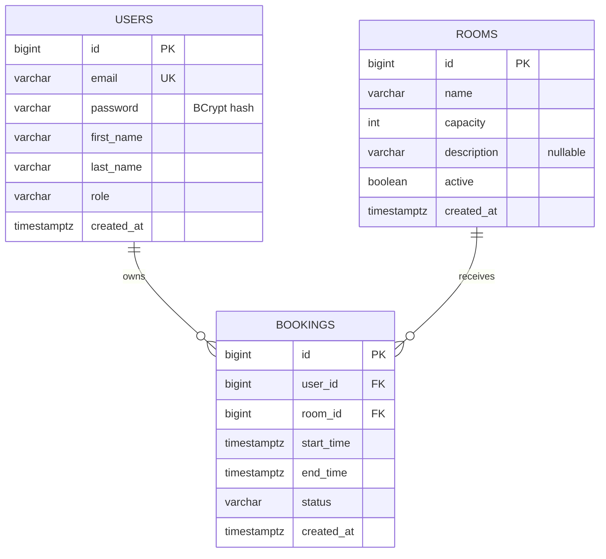

# Этап 2 — Database design

## Что и зачем делаем

Переводим требования в таблицы, связи и ограничения. SQL этого этапа находится
в `src/main/resources/db/migration/`. Пока нет pom.xml и приложения:
миграции можно проверить напрямую PostgreSQL; подключение Flyway будет позже.

Одна БД и обычные FK понятнее для учебного проекта, чем распределённые сервисы.
Используем BIGINT identity: идентификатор генерирует БД, API работает с числом.
UUID тоже возможен, но публичные непредсказуемые id здесь не требование.
Проверка владельца обязательна независимо от типа id.

## Структура файлов

```text
docs/02-database-design.md
docs/schema-verification.md
src/main/resources/db/migration/
  V1__create_users.sql
  V2__create_rooms.sql
  V3__create_bookings.sql
  V4__prevent_overlapping_bookings.sql
```

Не меняем уже применённые миграции: последующие изменения — V5, V6 и т.д.
V4 отдельно показывает, какое ограничение отвечает за конкуренцию. Все четыре
миграции должны быть применены до обслуживания запросов.

## Таблицы и типы

| Таблица | Поля |
|---|---|
| users | id BIGINT PK; email VARCHAR(254) UNIQUE; password VARCHAR(60); first_name/last_name VARCHAR(100); role VARCHAR(10); created_at TIMESTAMPTZ |
| rooms | id BIGINT PK; name VARCHAR(100); capacity INTEGER; description VARCHAR(2000) nullable; active BOOLEAN; created_at TIMESTAMPTZ |
| bookings | id BIGINT PK; user_id/room_id BIGINT FK; start_time/end_time TIMESTAMPTZ; status VARCHAR(10); created_at TIMESTAMPTZ |

Все поля, кроме description, NOT NULL. User и Room могут иметь 0..N броней;
каждая Booking имеет ровно одного владельца и одну комнату. Каскадного удаления
нет: FK с ON DELETE RESTRICT сохраняют историю. DELETE API меняет статус/active.

`password` хранит BCrypt hash длиной 60 символов. Название сохранено из модели
задачи, но в DTO ответа этого поля не будет. Комментарий SQL не проверяет,
что строка действительно hash: кодирование — обязанность сервиса/security.
Если позже сменим алгоритм или добавим префикс DelegatingPasswordEncoder,
расширим колонку отдельной миграцией.

Email сохраняем lowercase+trim: UNIQUE обеспечивает уникальность при гонке
регистраций, CHECK не допускает ненормализованное хранение. @Email останется
проверкой DTO; SQL не пытается реализовать весь стандарт email.

Enum сохраняем строкой + CHECK. Это проще связать с JPA EnumType.STRING,
чем PostgreSQL enum. Ordinal не используем: перестановка Java enum меняет смысл
чисел в существующих записях.

Время — Instant в Java и timestamptz в БД. Нужен однозначный момент времени,
а не LocalDateTime без зоны. Исходное название зоны не сохраняется;
показывать время офиса будет клиент. Запрет infinity — защита границ расписания.

## ER diagram



## Какие правила защищает БД

| Правило | Механизм |
|---|---|
| Уникальный нормализованный email | UNIQUE + CHECK |
| Существующие владелец и комната | FOREIGN KEY |
| Обязательные поля | NOT NULL |
| Положительная вместимость | CHECK capacity > 0 |
| Допустимые role/status | CHECK IN (…) |
| Непустой интервал | CHECK end_time > start_time |
| Отсутствие пересечений ACTIVE одной комнаты | Частичный EXCLUDE USING gist |

Проверку `start_time > now()` оставляем сервису. «Будущее» зависит от момента
проверки; вчера валидная запись сегодня становится исторической. CHECK подходит
для устойчивых свойств строки, а не для постоянно меняющегося времени.
`room.active` — свойство другой таблицы: не пытаемся проверить его обычным CHECK.
Сервис читает Room под блокировкой. Прямой SQL обходит это правило сервиса,
но всё равно не сможет обойти exclusion constraint на пересечения.

`created_at DEFAULT current_timestamp` заполняет время для SQL-вставок.
На этапе Entities добавим @CreatedDate и JPA auditing; сервер задаёт createdAt,
DTO ввода его не содержит, JPA колонка будет updatable=false. Полной истории
изменений статусов в MVP нет, и обычный SQL пользователь всё ещё может менять created_at.

## Почему exists + save недостаточно

```text
Transaction A: exists(overlap) -> false
Transaction B: exists(overlap) -> false
Transaction A: INSERT
Transaction B: INSERT
```

При обычном READ COMMITTED одна аннотация @Transactional не делает
«проверить отсутствие, затем вставить» неделимой операцией.
UNIQUE(room_id, start_time, end_time) запрещает только одинаковые тройки,
но пропускает [10:00, 11:00) и [10:30, 11:30).

Ключевая часть V4:

```sql
CREATE EXTENSION IF NOT EXISTS btree_gist;

ALTER TABLE bookings
    ADD CONSTRAINT ex_bookings_room_active_period
    EXCLUDE USING gist (
        room_id WITH =,
        tstzrange(start_time, end_time, '[)') WITH &&
    )
    WHERE (status = 'ACTIVE');
```

- `room_id WITH =`: сравниваем записи одной комнаты.
- `tstzrange(...) WITH &&`: запрещаем пересечение временных диапазонов.
- `'[)'`: начало включено, конец исключён; соседние встречи допустимы.
- `WHERE`: CANCELLED не участвуют в ограничении.
- `btree_gist`: поддержка равенства BIGINT в GiST.

Это рекомендованный для проекта способ защиты инварианта. Он действует для
каждой записи в БД, даже из другого экземпляра приложения или SQL-консоли.
При конкурирующих вставках PostgreSQL ждёт разрешения конфликтующей транзакции:
если первая фиксируется, вторая получает exclusion_violation (SQLSTATE 23P01);
если первая откатывается, вторая может пройти.

Источник механизма: [PostgreSQL Range Types](https://www.postgresql.org/docs/17/rangetypes.html#RANGETYPES-CONSTRAINT).

## Transactions и locking в будущем сервисе

Для нашего небольшого API выберем понятный консервативный протокол:

1. @Transactional на публичном методе Service; изоляция READ COMMITTED.
2. Загрузить Room через repository с PESSIMISTIC_WRITE (`SELECT … FOR UPDATE`).
3. Проверить active и время через Clock **после ожидания блокировки**.
4. При желании предварительно проверить overlap для понятного сообщения.
5. INSERT и flush; успешно завершить транзакцию; вернуть DTO.

Изменение/deactivation комнаты берёт ту же блокировку. Поэтому нельзя проверить
active=true, дождаться завершения деактивации и вставить бронь по устаревшему
значению. Цена простоты — создания в одной комнате выполняются последовательно,
даже для разных интервалов. Разные комнаты не блокируют друг друга этой блокировкой.
Exclusion constraint остаётся последней гарантией от пересечений.

Превращение SQLSTATE 23P01 **и нужного имени constraint** в 409 сделаем на этапе 11.
Не каждое DataIntegrityViolationException означает занятую комнату: есть FK,
NOT NULL, уникальность email. После ошибки SQL транзакция должна откатиться;
нельзя ловить исключение и продолжать запросы в той же повреждённой транзакции.
flush помогает обнаружить ошибку до выхода из метода, но не заменяет commit.

Источник семантики блокировки: [PostgreSQL Explicit Locking](https://www.postgresql.org/docs/17/explicit-locking.html#LOCKING-ROWS).

## Альтернативы

| Подход | Плюсы | Ограничения |
|---|---|---|
| Только exists | Понятен | Не защищает от гонки |
| synchronized | Просто в одном JVM | Не работает между несколькими процессами приложения |
| Только @Transactional / READ COMMITTED | Атомарный rollback | Не запрещает два concurrent INSERT |
| Room FOR UPDATE + check | Просто; работает между инстансами | Все пути записи обязаны брать одну блокировку; сериализация на комнату |
| @Version на Booking | Защищает обновление одной записи | Две новые Booking не конфликтуют по версии |
| SERIALIZABLE | Выявляет аномалии транзакций | Нужен ограниченный retry всей транзакции при serialization failure |
| EXCLUDE | Защита самого инварианта на уровне БД | Привязка к PostgreSQL и обработка constraint violation |

Наш выбор: EXCLUDE + короткая транзакция + блокировка Room ради согласованной
деактивации. Это две разные гарантии. Позже можно исследовать совместные блокировки
или другие протоколы, если измерения покажут проблему производительности.
Не блокируем найденные Booking вместо Room: при отсутствии бронирований
не будет строки, которую можно заблокировать.

## Индексы и стоимость

- PK и UNIQUE(email) уже создают индексы; дублировать их не нужно.
- `(name, id) WHERE active=true` — каталог активных комнат.
- `(user_id, start_time DESC, id DESC)` — свои брони.
- `(start_time DESC, id DESC)` — все брони администратора.
- `(room_id, start_time)` — история комнаты, включая отменённые, и FK lookup.
- EXCLUDE создаёт частичный GiST для ACTIVE интервалов.

Обычный JPQL overlap с `<`/`>` может использовать B-tree, а не GiST;
для GiST-поиска потребуется запрос с диапазоном и `&&`. Это проверяется EXPLAIN
на реалистичных данных; не обещаем использование конкретного индекса без плана.
Не индексируем каждое поле/каждую разрешённую сортировку: это замедляет запись.

Ограничения и индексы сверены с [PostgreSQL Constraints](https://www.postgresql.org/docs/17/ddl-constraints.html).

## Типичные ошибки Junior

- Хранить даты строкой или без согласованной временной зоны.
- Использовать `<=` в обеих частях overlap и запрещать встречи подряд.
- Удалять Room каскадно вместе с историей бронирований.
- Считать @Future единственной проверкой времени: запрос мог ждать lock.
- Ловить любую ошибку SQL и отвечать «Комната занята».
- Проверять PostgreSQL-specific constraints на H2.
- Подменять Flyway схемой Hibernate ddl-auto=update.

## Самостоятельное задание

Для существующей брони [10:00, 11:00) определи исход вставки:
[09:30, 10:00), [10:30, 11:30), [10:00, 11:00), [11:00, 12:00).
Повтори рассуждение для другой комнаты и для CANCELLED записи.
Объясни своими словами, почему блокировка Room существует отдельно от EXCLUDE.
Затем изучи V1–V4 и найди, какое правило остаётся ответственностью сервиса.
